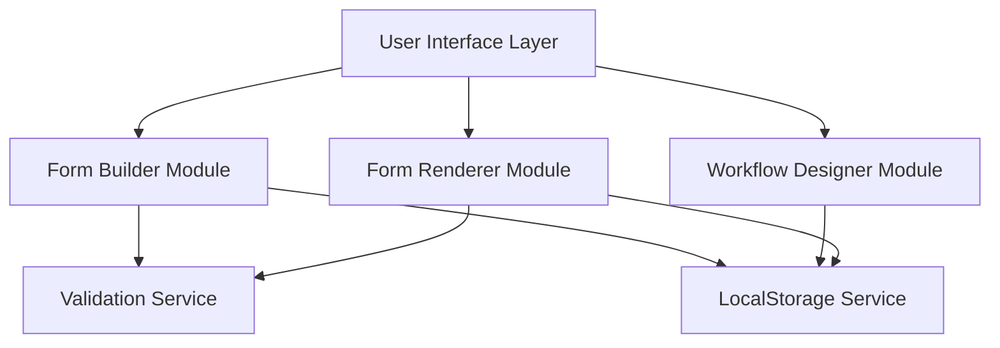

# Design Document: Form Workflow Builder

## Overview

The Form Workflow Builder is a frontend-only web application that enables users to create custom forms and design visual workflows for processing form submissions. The system consists of three main components: a Form Builder for designing forms with drag-and-drop functionality, a Workflow Designer for creating visual multi-step processes, and a Form Renderer for displaying and submitting forms. All data is persisted in browser localStorage, making it a lightweight solution perfect for demonstrations and prototyping.

The architecture follows a component-based approach with reusable field components, a flexible validation system, and visual workflow representation. The design emphasizes simplicity, modularity, and a modern, minimal user interface.

## Architecture

### High-Level Architecture



### Component Layers

1. **Presentation Layer**: React-based UI components for form building, workflow design, and form rendering
2. **Business Logic Layer**: Services for form management, validation, and data persistence
3. **Storage Layer**: LocalStorage abstraction for storing forms, submissions, and workflows

### Technology Stack

- **Frontend**: React with TypeScript, TailwindCSS for styling, React DnD for drag-and-drop
- **State Management**: React Context API or Zustand for global state
- **Validation**: Zod for schema validation
- **Storage**: Browser localStorage for data persistence
- **Build Tool**: Vite for fast development and building

## Components and Interfaces

### Form Builder Module

**Responsibilities:**
- Render drag-and-drop canvas for form design
- Manage field component library
- Handle field configuration and property editing
- Generate form schema from visual design
- Provide live preview functionality
- Save/load forms from localStorage

**Key Interfaces:**

```typescript
interface FormSchema {
  id: string;
  name: string;
  description: string;
  fields: FieldDefinition[];
  styling: FormStyling;
  workflowId?: string;
  createdAt: Date;
  updatedAt: Date;
}

interface FieldDefinition {
  id: string;
  type: FieldType;
  label: string;
  placeholder?: string;
  defaultValue?: any;
  required: boolean;
  validation: ValidationRule[];
  conditionalLogic?: ConditionalRule[];
  position: { x: number; y: number };
  width: number;
}

type FieldType = 
  | 'text' 
  | 'number' 
  | 'email' 
  | 'date' 
  | 'dropdown' 
  | 'multiselect' 
  | 'checkbox' 
  | 'radio' 
  | 'file' 
  | 'textarea';

interface ValidationRule {
  type: ValidationType;
  value?: any;
  message: string;
}

type ValidationType = 
  | 'required' 
  | 'minLength' 
  | 'maxLength' 
  | 'minValue' 
  | 'maxValue' 
  | 'pattern' 
  | 'email';

interface ConditionalRule {
  fieldId: string;
  operator: 'equals' | 'notEquals' | 'contains' | 'greaterThan' | 'lessThan';
  value: any;
  action: 'show' | 'hide';
  logicOperator?: 'AND' | 'OR';
}

interface FormStyling {
  theme: 'light' | 'dark';
  primaryColor: string;
  backgroundColor: string;
  fontFamily: string;
}
```

### Workflow Designer Module

**Responsibilities:**
- Provide visual workflow canvas
- Manage workflow step library
- Handle step configuration
- Validate workflow structure
- Save/load workflows from localStorage

**Key Interfaces:**

```typescript
interface WorkflowDefinition {
  id: string;
  formId: string;
  name: string;
  steps: WorkflowStep[];
  connections: WorkflowConnection[];
  createdAt: Date;
  updatedAt: Date;
}

interface WorkflowStep {
  id: string;
  type: StepType;
  name: string;
  config: StepConfig;
  position: { x: number; y: number };
}

type StepType = 
  | 'approval' 
  | 'notification' 
  | 'transform' 
  | 'condition' 
  | 'webhook';

interface StepConfig {
  // Approval step
  approverEmail?: string;
  approvalTimeout?: number;
  
  // Notification step
  recipients?: string[];
  template?: string;
  
  // Transform step
  transformations?: DataTransformation[];
  
  // Condition step
  condition?: string;
  truePath?: string;
  falsePath?: string;
  
  // Webhook step
  url?: string;
  method?: 'GET' | 'POST' | 'PUT';
  headers?: Record<string, string>;
}

interface WorkflowConnection {
  id: string;
  fromStepId: string;
  toStepId: string;
  label?: string;
}

interface DataTransformation {
  field: string;
  operation: 'map' | 'filter' | 'format';
  expression: string;
}
```

### Form Renderer Module

**Responsibilities:**
- Render forms for end users
- Handle form submission
- Evaluate conditional logic in real-time
- Validate form data
- Save submissions to localStorage

**Key Interfaces:**

```typescript
interface FormSubmission {
  id: string;
  formId: string;
  data: Record<string, any>;
  submittedBy?: string;
  submittedAt: Date;
  workflowId?: string;
}

interface FormRendererProps {
  formId: string;
  mode: 'preview' | 'submit';
  onSubmit?: (submission: FormSubmission) => void;
}
```

### Validation Service

**Responsibilities:**
- Validate form submissions against field rules
- Evaluate conditional logic
- Provide validation error messages

**Key Interfaces:**

```typescript
interface ValidationService {
  validateSubmission(
    schema: FormSchema, 
    data: Record<string, any>
  ): ValidationResult;
  
  validateField(
    field: FieldDefinition, 
    value: any
  ): FieldValidationResult;
  
  evaluateConditionalLogic(
    rules: ConditionalRule[], 
    formData: Record<string, any>
  ): boolean;
}

interface ValidationResult {
  valid: boolean;
  errors: FieldError[];
}

interface FieldError {
  fieldId: string;
  message: string;
  rule: ValidationType;
}

interface FieldValidationResult {
  valid: boolean;
  error?: string;
}
```

### LocalStorage Service

**Responsibilities:**
- Persist forms, workflows, and submissions to localStorage
- Retrieve data from localStorage
- Handle storage quota limits
- Provide data export/import functionality

**Key Interfaces:**

```typescript
interface LocalStorageService {
  // Forms
  saveForm(form: FormSchema): void;
  getForm(id: string): FormSchema | null;
  getAllForms(): FormSchema[];
  deleteForm(id: string): void;
  
  // Workflows
  saveWorkflow(workflow: WorkflowDefinition): void;
  getWorkflow(id: string): WorkflowDefinition | null;
  getWorkflowByFormId(formId: string): WorkflowDefinition | null;
  deleteWorkflow(id: string): void;
  
  // Submissions
  saveSubmission(submission: FormSubmission): void;
  getSubmission(id: string): FormSubmission | null;
  getSubmissionsByFormId(formId: string): FormSubmission[];
  deleteSubmission(id: string): void;
  
  // Utility
  exportAllData(): string; // JSON export
  importData(jsonData: string): void;
  clearAllData(): void;
  getStorageUsage(): { used: number; available: number };
}
```

## Data Models

### LocalStorage Structure

**Storage Keys:**
```typescript
const STORAGE_KEYS = {
  FORMS: 'formBuilder_forms',
  WORKFLOWS: 'formBuilder_workflows',
  SUBMISSIONS: 'formBuilder_submissions',
  SETTINGS: 'formBuilder_settings'
};
```

**Data Format:**

Forms are stored as an array:
```json
{
  "formBuilder_forms": [
    {
      "id": "uuid",
      "name": "Contact Form",
      "description": "A simple contact form",
      "fields": [...],
      "styling": {...},
      "workflowId": "uuid",
      "createdAt": "2024-01-01T00:00:00Z",
      "updatedAt": "2024-01-01T00:00:00Z"
    }
  ]
}
```

Workflows are stored as an array:
```json
{
  "formBuilder_workflows": [
    {
      "id": "uuid",
      "formId": "uuid",
      "name": "Approval Workflow",
      "steps": [...],
      "connections": [...],
      "createdAt": "2024-01-01T00:00:00Z",
      "updatedAt": "2024-01-01T00:00:00Z"
    }
  ]
}
```

Submissions are stored as an array:
```json
{
  "formBuilder_submissions": [
    {
      "id": "uuid",
      "formId": "uuid",
      "data": {
        "field1": "value1",
        "field2": "value2"
      },
      "submittedBy": "user@example.com",
      "submittedAt": "2024-01-01T00:00:00Z",
      "workflowId": "uuid"
    }
  ]
}
```


## Correctness Properties

A property is a characteristic or behavior that should hold true across all valid executions of a system—essentially, a formal statement about what the system should do. Properties serve as the bridge between human-readable specifications and machine-verifiable correctness guarantees.

### Property 1: Field type support

*For any* supported field type (text, number, email, date, dropdown, multiselect, checkbox, radio, file, textarea), creating a field definition with that type should result in a valid field definition.

**Validates: Requirements 1.3**

### Property 2: Form persistence round-trip

*For any* valid form schema, saving the form to localStorage then loading it should return an equivalent form schema with all properties preserved.

**Validates: Requirements 1.5, 9.2**

### Property 3: Validation rule support

*For any* supported validation rule type (required, minLength, maxLength, minValue, maxValue, pattern, email), adding that rule to a field definition should result in a valid field definition.

**Validates: Requirements 2.1**

### Property 4: Validation rejection on failure

*For any* form schema with validation rules and any submission data that violates those rules, the validation service should reject the submission and return validation errors.

**Validates: Requirements 2.2, 2.4**

### Property 5: Validation error messages

*For any* field with a failed validation rule, the validation service should generate an error message that identifies the field and the validation failure.

**Validates: Requirements 2.3**

### Property 6: Conditional logic support

*For any* field with conditional logic rules (show/hide based on other fields), the field definition should be valid and the rules should be evaluable.

**Validates: Requirements 3.1**

### Property 7: Conditional logic evaluation

*For any* form with conditional logic rules and any form data, the system should correctly determine which fields should be visible based on the current field values.

**Validates: Requirements 3.2**

### Property 8: Hidden field exclusion

*For any* field that is hidden by conditional logic, that field should be excluded from validation and should not appear in the submission data.

**Validates: Requirements 3.3**

### Property 9: Multiple condition support

*For any* field with multiple conditional rules using AND/OR operators, the system should correctly evaluate the combined logic to determine field visibility.

**Validates: Requirements 3.4**

### Property 10: Circular dependency detection

*For any* form schema with conditional logic rules, the system should detect and reject circular dependencies where field A's visibility depends on field B, and field B's visibility depends on field A (directly or transitively).

**Validates: Requirements 3.5**

### Property 11: Workflow step type support

*For any* supported workflow step type (approval, notification, transform, condition, webhook), creating a workflow step with that type should result in a valid step definition.

**Validates: Requirements 4.2**

### Property 12: Workflow step configuration

*For any* workflow step, the system should support configuration of step-specific parameters appropriate to that step type.

**Validates: Requirements 4.3**

### Property 13: Workflow connection support

*For any* two workflow steps, the system should allow creating a connection from one step to another to define execution order.

**Validates: Requirements 4.4**

### Property 14: Orphaned step detection

*For any* workflow definition, the system should detect and reject workflows that contain steps with no incoming or outgoing connections (except for start and end steps).

**Validates: Requirements 4.5**

### Property 15: Submission storage

*For any* form submission, the system should store the submission in localStorage with a timestamp and submitter information (if available).

**Validates: Requirements 5.1, 5.2**

### Property 16: Submission retrieval

*For any* stored submission, retrieving it from localStorage should return the same submission data that was stored.

**Validates: Requirements 5.3, 9.2**

### Property 17: Submission filtering

*For any* filter criteria (field values, date range), querying submissions should return only submissions that match all specified criteria.

**Validates: Requirements 6.3**

### Property 18: Workflow association

*For any* submission that has an associated workflow, querying the submission should return the workflow ID.

**Validates: Requirements 6.4**

### Property 19: Submission export round-trip

*For any* set of submissions, exporting to JSON format then parsing the exported data should preserve all submission data.

**Validates: Requirements 6.5**

### Property 20: Rendering mode selection

*For any* form access, if accessed in preview mode, the system should render the form without builder interface elements; if accessed in builder mode, it should include builder interface.

**Validates: Requirements 8.2**

### Property 21: LocalStorage persistence

*For any* form, workflow, or submission saved to localStorage, reloading the application should retrieve the same data.

**Validates: Requirements 9.4**

### Property 22: Storage quota handling

*For any* attempt to save data when localStorage is full, the system should detect the quota exceeded error and notify the user.

**Validates: Requirements 9.5**

## Error Handling

### Form Builder Errors

1. **Invalid Field Configuration**: When a field is configured with incompatible properties (e.g., minLength on a number field), display a clear error message indicating the issue
2. **Circular Conditional Logic**: When circular dependencies are detected in conditional rules, prevent form save and highlight the problematic fields
3. **Missing Required Properties**: When required field properties are missing, prevent form save and indicate which properties need to be provided

### Validation Errors

1. **Field Validation Failure**: Return field-specific error messages that can be displayed next to the invalid field
2. **Type Mismatch**: When submitted data doesn't match the expected field type, return a type error with the expected and actual types
3. **Custom Validation Errors**: Support custom error messages for each validation rule

### Workflow Errors

1. **Invalid Workflow Structure**: When a workflow has orphaned steps or invalid connections, prevent workflow save and highlight structural issues
2. **Missing Configuration**: When a workflow step is missing required configuration (e.g., approver email for approval step), prevent workflow save

### Storage Errors

1. **LocalStorage Quota Exceeded**: When localStorage is full, display a clear error message and suggest clearing old data or exporting data
2. **Data Corruption**: When loading data from localStorage fails due to corruption, handle gracefully and allow user to clear corrupted data
3. **JSON Parse Errors**: When importing data, validate JSON format and provide clear error messages for invalid data

## Testing Strategy

### Unit Testing

Unit tests will verify specific examples, edge cases, and error conditions for individual components and functions. Focus areas include:

- **Field validation functions**: Test each validation rule type with valid and invalid inputs
- **Conditional logic evaluator**: Test various condition combinations with AND/OR operators
- **Circular dependency detection**: Test detection of circular references in conditional logic
- **LocalStorage service**: Test save/load operations, quota handling, and error cases
- **Form rendering**: Test field visibility based on conditional logic
- **Data export/import**: Test JSON serialization and deserialization

Unit tests should be co-located with source files using `.test.ts` or `.test.tsx` suffix and focus on concrete examples that demonstrate correct behavior.

### Property-Based Testing

Property-based tests will verify universal properties across all inputs using randomized test data. We will use **fast-check** as the property-based testing library for TypeScript/JavaScript.

**Configuration:**
- Each property test must run a minimum of 100 iterations
- Each test must be tagged with a comment referencing the design property
- Tag format: `// Feature: form-workflow-builder, Property {number}: {property_text}`

**Test Coverage:**

Each correctness property listed above must be implemented as a property-based test. Key testing patterns include:

1. **Round-trip properties**: Form persistence, submission storage, data export
2. **Invariant properties**: Validation rules, conditional logic evaluation, field visibility
3. **Error condition properties**: Circular dependency detection, orphaned step detection, validation failures
4. **Storage properties**: LocalStorage persistence, quota handling

**Generator Strategy:**

Smart generators will be implemented to constrain the input space intelligently:

- **Form schema generator**: Generate valid form schemas with various field types, validation rules, and conditional logic
- **Submission data generator**: Generate data that matches form schema field types
- **Workflow definition generator**: Generate valid workflow structures with connected steps
- **Invalid input generators**: Generate specific invalid inputs to test error handling (circular dependencies, orphaned steps, invalid data types)

### Component Testing

Component tests will verify React components render correctly and handle user interactions:

- **Form Builder**: Test drag-and-drop functionality, field configuration, live preview
- **Workflow Designer**: Test step placement, connection creation, configuration panel
- **Form Renderer**: Test form display, conditional field visibility, validation feedback
- **Submission List**: Test filtering, sorting, export functionality

Component tests will use React Testing Library for rendering and interaction testing.

### Integration Testing

Integration tests will verify that components work together correctly:

- **Form creation flow**: Create form → add fields → configure validation → save → load
- **Form submission flow**: Load form → fill fields → validate → submit → store in localStorage
- **Workflow design flow**: Create workflow → add steps → connect steps → validate → save
- **Data persistence flow**: Create forms/workflows/submissions → reload app → verify data persists

### End-to-End Testing

E2E tests will verify complete user workflows through the UI:

- Create a form with drag-and-drop
- Configure field validation and conditional logic
- Preview form and submit test data
- Create a workflow and associate with form
- View submissions and export data

E2E tests will use Playwright or Cypress for browser automation (optional for MVP).

### Performance Testing

Performance considerations for the frontend:

- Form rendering with large numbers of fields (50+ fields)
- Conditional logic evaluation with complex rule sets
- LocalStorage operations with large datasets
- Export operations with many submissions

Performance benchmarks will be established for key operations to ensure smooth user experience.
